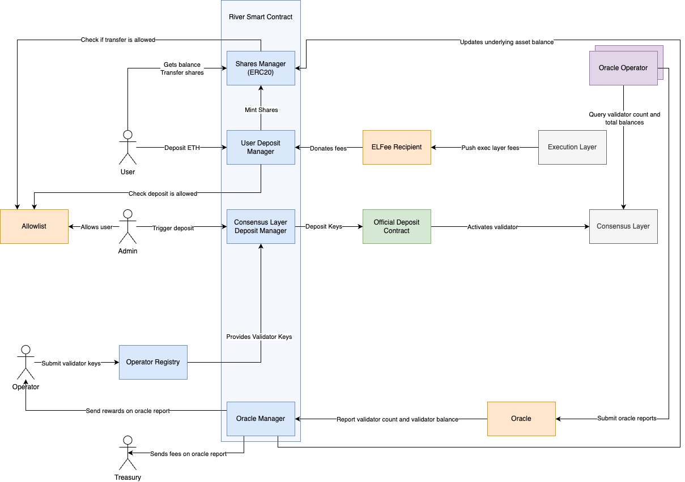
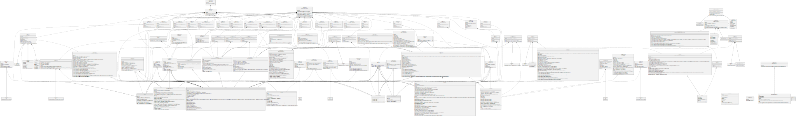

# Welcome to Liquid Collective contributing guide
Thank you for investing your time in contributing to our project!

Read our [Code of Conduct](./CODE_OF_CONDUCT.md) to keep our community approachable and respectable.

In this guide you will get an overview of the contribution workflow from opening an issue, creating a PR, reviewing, and merging the PR.

## Contribution steps
Below we describe the workflow to contribute to this repository:

1. Open an issue describing what you intend to work on. Be as detailed as possible.
2. Maintainers will discuss your issue and validate whether we would accept a PR for this.
3. Open a PR:
   1. Fork the repository.
   2. Create your branch.
   3. Open your PR against `main`. We use semantic commits (feat: / fix: / chore: / etc..). Your PR title must express the content of your contribution.
   4. Fill the PR template with relevant information.
4. Your PR will be reviewed by code owners.
5. Your PR will be merged by code owners.

## Field Guide
Users interact with the Liquid Collective protocol smart contract, River, through an upgradeable proxy, defined at `contracts/src/TUPProxy.sol`. This requires us to use [unstructured storage](https://blog.openzeppelin.com/upgradeability-using-unstructured-storage/), a Solidity pattern in which we save state variables in their own library rather than as in-line variables in the contract manipulating those variables. Each variable's library comes with its own getters and setters for the variable value. This lets a future version of the contract access the same values that the old version was relying on. 
River, as an upgradeable smart contract, must also use an Initializer (`contracts/src/Initializer.sol`) to mimic a constructor, since a proxy cannot call that constructor. [See here](https://docs.openzeppelin.com/upgrades-plugins/1.x/writing-upgradeable#initializers).

`TUPProxy.sol` points to the logic at `River.{VERSION_NUMBER}.sol`. In turn, `River.sol` uses the managers in `contracts/src/components/` to accomplish the following logic:

- `TransferManager` to handle incoming ETH from stakers
- `DepositManager` to take deposited ETH and allocate it to validators
- `OperatorsManager` to handle the node operators
- `OracleManager` to receive input from `Oracle.sol`
- `SharesManager` as the ERC20 implementation to credit initial deposits, & reflect earnings reported by the oracle in rebased LsETH balances

`River.sol`, as well as the managers it uses, leverages the state libraries in `contracts/src/state/` to read & set the variables in unstructured storage.

`River.sol` will get its withdrawal logic from `contracts/src/Withdraw.sol`. Since the actual protocol for moving ETH off of a validator post-merge has not yet been defined, this contract is a temporary stub contract, which will be upgraded post-merge.

`Oracle.sol` receives reports of staking rewards from designated reporters, and pushes the data to `River.sol` to modify LsETH balances.

`AllowList.sol` handles the list of recipients allowed to interact with River. `River.sol` reads from it.

We wrap `AllowList`, `Oracle` and `River` in a `Firewall.sol`, through which administrators can make onlyAdmin function calls.

## Architecture


## Governance


### System Administrator
Administrator in charge of the implementation logics, can perform any task on any administrable contract.

### System Executor
Administrator only able to perform a subset of tasks on the system. This set of tasks is defined in the Firewall.

### Firewall
Contract that is the admin of the other system contracts of River. The Firewall stores 2 actors: an admin and an executor. The admin is able to perform any call on the Firewall and the Firewall will forward the call to the system component. The executor has a set of selector he is allowed to call on the system and the Firewall will only forward these calls.

### Implementation Administrator
Administrator of the proxy contracts, has the ability to upgrade the implementation or pause the contracts.

## Scripts

### Install dependencies
```
yarn && yarn link_contracts
```

### Run tests
```
yarn test
```

### Run tests include fork tests
```
env MAINNET_FORK_URL=... yarn test
```

The URL provided must be an archive node endpoint allowing state queries at arbitrary block numbers.

### Run checks
```
yarn lint:check && yarn format:check
```

### Deploy
You need to define the `MNEMONIC` env variable before running these scripts. The mnemonic should unlock an account with enough ETH to cover deployment fees. The deployment account has no ownership on the contracts deployed. Core components addresses are configured in `hardhat.config.ts` in the `namedAccounts` section.

#### Local
To deploy the contracts in an ephemeral EVM instance, run
```
yarn hh deploy
```

#### Goerli
Deployment on the goerli test network using the Prater Beacon test chain.
```
yarn hh --network goerli
```

#### Goerli with mocked DepositContract
Deployment on the goerli test network using a mocked DepositContract that emits the same event as the real DepositContract, but transfers back the funds to the treasury address.
```
yarn hh --network mockedGoerli
```
### Submodules
Submodules should only be updated by maintainers. If you happen to have submodules included in your PR, please run the following:
```
git submodule update --init --recursive
```

## Components Overview


Generate by running `yarn uml`

### Interfaces
| Contract      | Documentation                  |
|---------------|--------------------------------|
| `RiverV1`     | [📜](./natspec/RiverV1.md)     |
| `OracleV1`    | [📜](./natspec/OracleV1.md)    |
| `AllowlistV1` | [📜](./natspec/AllowlistV1.md) |
| `WithdrawV1`  | [📜](./natspec/WithdrawV1.md)  |

## Live Deployments
All addresses can be found inside the `deployment.NETWORK.json` files

