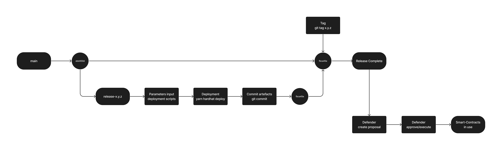

# Protocol Release Process

## Overview

## Step-by-step

1. Create a release branch `release/x.y.z` from the commit we want in `main`
2. Input the parameter in the [deployment scripts](deploy)
3. Deploy the contracts with `env PRIVATE_KEY=<private_key> RPC_URL=<rpc_url> yarn hardhat deploy --network <network> --deploy-scripts ./deploy/<network>`
4. Generate meta artifacts `env PRIVATE_KEY=<private_key> RPC_URL=<rpc_url> yarn hh run --network <network> ./hardhat_scripts/gen_root_artifacts.ts` & `env PRIVATE_KEY=<> RPC_URL=<> yarn hh run --network <network> ./hardhat_scripts/gen_meta_artifacts.ts`
5. Commit the generated artifacts in the [deployment folders](deployments)
6. Merge `release/x.y.z` into `main`
7. Create the GitHub Release with the relevant `x.y.z` tag
8. Create the upgrade proposal in Defender
9. Get the necessary approvals
10. Execute the upgrade proposal in Defender
11. We're done !